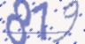
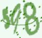
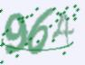

# 数字识别

本次竞赛的目的是对由3位数字构成的图像进行识别，例如，当图像中的数字为001时，识别结果为1；当图像中的数字为011时，识别结果为11；当图像中的数字为111时，识别结果为111。

## 赛制介绍

本次比赛系机器学习方向2016级内部竞赛的第三次竞赛（决赛），旨在通过对图像数据进行建模分析，完整地完成比赛过程。通过本次比赛，学生应该掌握对图像数据的基本处理和熟悉计算机视觉领域的基本任务及解决方法等。

### 赛程安排

**时间**：10月31日-11月27日。

**流程**：

1.每位同学注册一个kaggle账号，并登入，然后打开指定链接，参与比赛，最后由小组组长将组员结合为一个team，每位同学可以查看相应的竞赛要求和数据集。

2.从该平台下载数据集，本地调试算法，并在该平台上提交结果，提交完成后，即得相应的分数并可以查看公共排名结果。（注意：公共排名仅供参考，比赛结束后，最终排名以私有排名为准）

3.每支参赛队伍每天有且仅有二次提交机会，高分成绩直接覆盖低分成绩。

4.比赛提供标准训练集（含标签），仅供参赛选手训练算法模型；提供标准测试数据集（无标签），供参赛选手提交评测结果参与排名。比赛中严禁使用外部数据集，一经发现，成绩作废。

5.比赛中需要使用代码管理工具对代码进行管理，并在提交结果之后存储当前代码作为提交成绩依据的记录，比赛结束公布最终排名时需提交取得最高成绩的代码。

6.比赛截止时，将对所有参赛队伍代码进行审核，识别并剔除只靠人工标注而没有算法贡献的队伍与使用重复代码参赛的队伍。

### 参赛对象

机器学习方向全体学生，并以小组为单位参赛。

### 成绩评定

根据比赛所设评价标准对参赛队伍提交的结果进行成绩评定并排名。比赛完成后将所有队伍分成三组：

**优秀组**：排名靠前6组。奖励包括较大幅度的平时成绩奖励、期末成绩奖励、其它奖励。

**合格组**：奖励包括平时成绩奖励、期末成绩奖励。

**不屈组**：排名靠后6组。无奖励。

### 比赛组织

软件学院机器学习教研室

## 赛题与数据

### 介绍

根据包含3位数字的图像数据来识别图像的内容。例如，当图像中的数字为001时，识别结果为1；当图像中的数字为011时，识别结果为11；当图像中的数字为111时，识别结果为111。

### 数据集

数据集包含以下四个文件：

|文件名称|文件格式|
|:---|:----|
|train.zip|.zip（19.8M）|
|test.zip|.zip（39.8M）|
|train_labels.csv|.csv（95 KB）|
|sample.csv|.csv（86 KB）|

`train.zip`为训练数据集，其中包含了10000张训练图像。`test.zip`为测试数据集，其中包含了20000张测试图像，当模型训练完成之后，需要对测试集进行预测得到预测结果。`train_labels.csv`为训练集标签。`sample.csv`为提交结果的参考模板。

数据集样本说明：每张图像的大小不一定相同，每张图像中包含一个三位数字。图像示例如下：

 	 	 

数据集标签说明：每一行文本代表一个样本标记，每一个整数代表一个图像类别，即图像中显示的数字大小。 

### 提交说明

预测测试集的结果的提交格式参考`sample.csv`中的格式进行提交。要求必须提交`.csv`格式文件，且每条结果与测试集的数据集一一对应。

###评价指标：

The evaluation metric for this competition is ***Accuracy.***
The Accuracy score is given by:		$Accuracy = (TP+TN) / (TP+TN+FP+FN)$
where: 
-  TP = True  positive  
-  FP = False positive
-  TN = True negative
-   FN = False negative

​                      
